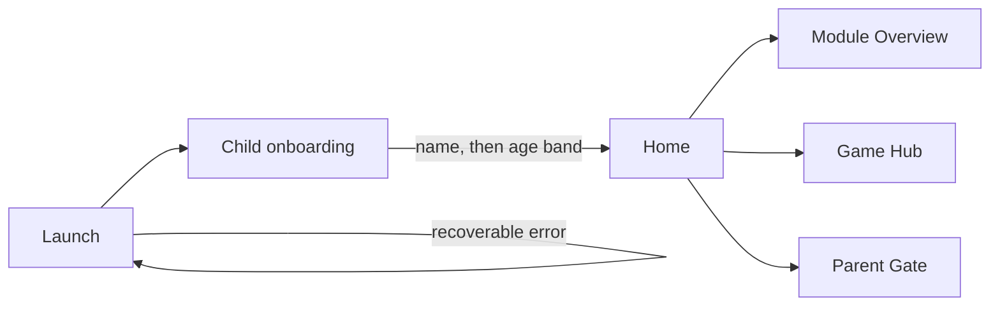
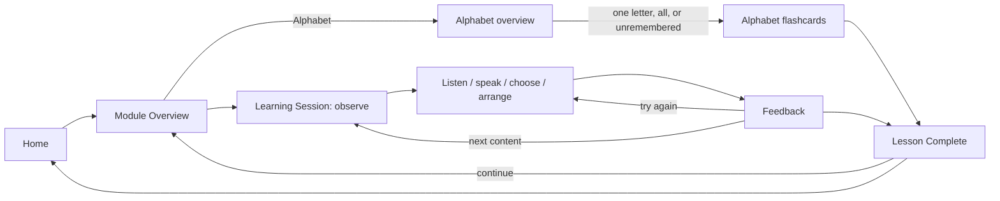
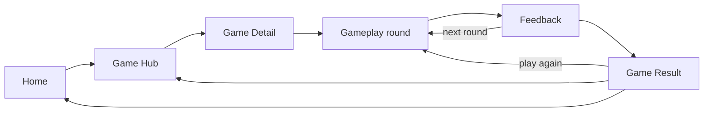
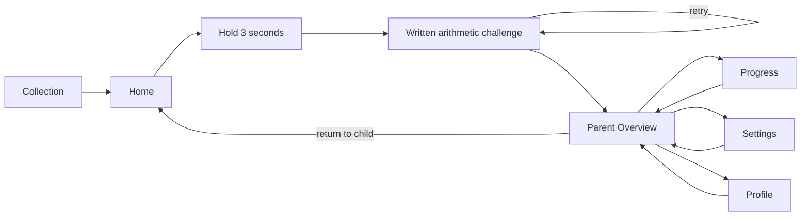
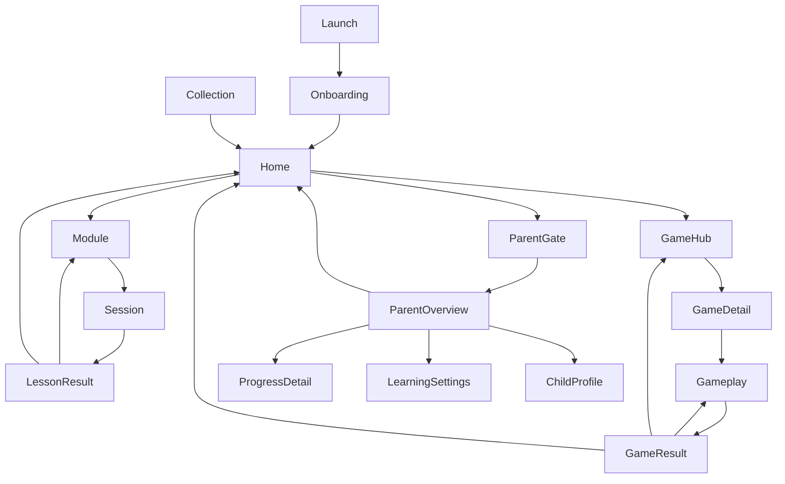

# Widgetbook executable screen architecture

> **Status:** phases 0 and 2 are implemented for a presentation-only prototype.
> The catalogue and shared presentation widgets exist; production routing,
> learning rules, persistence, audio, speech recognition, and backend adapters do
> not. The prototype uses local sample data only.

## 1. Product and prototype boundary

FlashKids has two visibly distinct zones:

- **Kid Zone:** the default experience. A child can choose a learning skill,
  complete a short visual activity, play a mini game, or view their collection.
- **Parent Zone:** compact, text-led progress and settings surfaces, always
  behind the approved parent gate.

The Widgetbook build is an executable conversation aid, not completed product
behavior. It proves screen hierarchy, responsive composition, accessible tap
targets, and forward/back paths. Buttons change sample screens and UI states;
they do not teach, score, store, recognize speech, play audio, or enforce policy.

The catalogue keeps the stable hierarchy `Components / Screens / App Prototype`.
There is exactly one published interactive app flow: `Full Application Flow`.
Run it with:

```sh
flutter run -d chrome -t widgetbook/main.dart
```

## 2. Information architecture

```text
FlashKids
├── System
│   ├── Launch
│   └── Child onboarding (prototype only)
├── Kid Zone (default)
│   ├── Home
│   │   ├── Tiếng Việt: Chữ cái, Đánh vần, Phát âm, Mini games
│   │   ├── Tiếng Anh: Chữ cái, Từ vựng, Phát âm, Mini games
│   │   ├── Toán: Cộng, Trừ, Mini games
│   │   └── Mini game → Game Hub (dynamic library)
│   ├── Module Overview / Activity Selection
│   ├── Learning Session (configured by skill + activity)
│   ├── Lesson Complete
│   ├── Game Hub
│   │   └── Game Detail → Gameplay → Game Result
│   └── My Collection
└── Parent Gate
    └── Parent Zone
        ├── Overview
        ├── Learning Progress
        ├── Difficult Content
        ├── Learning Settings
        └── Child Profile
```

Home presents four visually equal destination cards: Tiếng Việt, Tiếng Anh,
Toán, and Mini game. Each subject card leads to that subject's activities; the
Mini game card opens the Game Hub. Individual games never appear on Home. Game
Hub owns a data-driven library and can later add categories, search, difficulty,
and recommendations without changing top-level navigation.

In this Widgetbook prototype, first launch is `Launch → Child onboarding → Home`.
Onboarding asks one question per screen: first an adult enters the child's display
name, then selects one of the local age bands (`3–5`, `6–7`, or `8–10`). The
prototype uses that selection only for the current mounted flow to show two
lesson recommendations. It does not persist the data, create an account, alter
production routing, or claim adaptive learning. Multi-child setup remains a
future decision.

## 3. Screen inventory

| ID | Screen | Area | Single purpose | Entry | Exit | MVP |
|---|---|---|---|---|---|---|
| SYS-001 | Launch | System | Prepare and enter the child experience | App launch | Onboarding or recoverable error | Yes |
| SYS-002 | Child onboarding | System / adult | Ask display name, then age band, to preview recommendations | Launch | Home | Yes |
| KID-001 | Home | Kid | Choose a recommended lesson, subject, Mini game, or the quiet parent entry | Onboarding/result/back | Learning Session, Module, Game Hub, Gate | Yes |
| KID-002 | Module Overview | Kid | Choose one activity within a skill | Home | Learning Session or Home | Yes |
| KID-003A | Alphabet overview | Kid | Choose a letter or a flashcard study set | Vietnamese/English alphabet activity | Alphabet flashcards or Module | Yes |
| KID-003B | Alphabet flashcards | Kid | Review a selected letter deck and mark recall | Alphabet overview | Next card, result, or overview | Yes |
| KID-003 | Learning Session | Kid | Make one learning response | Module/next item | Feedback, next item, result, or exit | Yes |
| KID-004 | Lesson Complete | Kid | Celebrate effort and choose what happens next | Learning Session | Continue or Home | Yes |
| KID-005 | Game Hub | Kid | Choose a mini game from a dynamic library | Home/game result | Game Detail or Home | Yes |
| KID-006 | Game Detail | Kid | Understand one game and start it | Game Hub | Gameplay or Game Hub | Yes |
| KID-007 | Gameplay | Kid | Complete one visual game round | Game Detail/next round | Feedback, next round, or result | Yes |
| KID-008 | Game Result | Kid | Celebrate play and choose replay/hub/home | Gameplay | Replay, Game Hub, or Home | Yes |
| KID-009 | My Collection | Kid | Browse earned learning items and gentle progress | Catalogue representative screen | Home | Yes |
| PAR-001 | Parent Gate | Parent boundary | Verify deliberate adult intent | Quiet Home entry | Parent Overview or Home | Yes |
| PAR-002 | Parent Overview | Parent | Select a parent task and see a concise summary | Gate/parent detail | Progress, Settings, Profile, or Kid Zone | Yes |
| PAR-003 | Progress Detail | Parent | Review progress and difficult content | Parent Overview | Parent Overview | Yes |
| PAR-004 | Learning Settings | Parent | Chuyển hồ sơ bé và cấu hình chữ, loại tài khoản, âm thanh, giọng nói, nhắc học | Parent Overview | Save/back | Yes |
| PAR-005 | Child Profile | Parent | Review or edit child-facing profile data | Parent Overview | Save/back | Phase 2 |

## 4. Screen contracts and states

| Screen | Primary action | Main components | Meaningful states |
|---|---|---|---|
| Launch | Continue automatically when ready | Brand, mascot, progress shape | loading, recoverable error |
| Child onboarding | Provide name, then age band | name field, three age-band choices, next/back actions | name step, age step, validation error |
| Home | Choose a large destination | greeting, mascot, recommended lesson list, four equal destination cards, quiet gate entry | first use, returning, loading, content unavailable |
| Module Overview | Start one activity | activity cards, progress shape | populated, loading, empty, content unavailable |
| Alphabet overview | Pick a letter or study set | visible alphabet grid, all/unremembered study actions | unremembered letters, all remembered |
| Alphabet flashcards | Mark recall and advance | letter flashcard, visible remember/unremembered actions | first card, in-progress, complete |
| Learning Session | Answer the current prompt | home/back, progress, visual prompt, audio/speak control when relevant, answer controls, mascot feedback | observe, listening, recording, processing, retry, success, audio unavailable, microphone denied, recognition failed, content unavailable |
| Lesson Complete | Continue learning | reward art, effort summary, sticker/star acknowledgement | complete, reward reduced-motion variant |
| Game Hub | Choose a game | featured card, dynamic grid/list, optional future category row | populated, loading, empty/no games, content unavailable |
| Game Detail | Start the game | game art, skill tags, short visual instructions | available, locked, content unavailable |
| Gameplay | Make one play response | game scene, progress, answer targets, pause/exit | active, feedback, paused, content unavailable |
| Game Result | Play again | reward art, effort summary, replay/hub/home actions | complete, reward reduced-motion variant |
| Collection | Browse earned items | mastery groups, stickers, achievements | first use/empty, populated, loading, content unavailable |
| Parent Gate | Complete the adult challenge | three-second hold affordance, written arithmetic challenge, cancel | idle, holding, challenge, retry |
| Parent Overview | Choose a parent task | learning summary, progress rows, difficult content, settings/profile entries | populated, loading, no activity yet, unavailable |
| Progress Detail | Review one skill | range summary, mastery rows, difficult items | populated, empty, loading, unavailable |
| Learning Settings | Chọn hồ sơ bé hoặc lưu tuỳ chọn | bộ chọn hồ sơ, cỡ chữ, loại tài khoản, điều khiển âm thanh dễ truy cập | loaded, saving, saved, save error |
| Child Profile | Save profile | name/avatar/age-band controls | loaded, validation error, saving, save error |

Every Kid Zone screen keeps Home/back in a predictable position, uses visible
equivalents for audio, and never relies on color alone. Error and permission
conditions are screen states or overlays, not extra destinations.

### Parent gate decision

For the prototype, the adult presses and holds the quiet Parent Zone control
for three seconds, then answers one written arithmetic challenge. Releasing
early resets the hold. A failed answer stays in the gate with neutral copy.
Leaving Parent Zone immediately returns to Kid Zone; passing is not persisted.

This mechanism was approved for the prototype on 2026-09-03. It must be reviewed
with real child usability and accessibility testing before production release.

## 5. Main user flows

### First launch and Home



### Shared learning flow



The shell is shared: context, progress, focal content, response, immediate
feedback, next, completion. Configuration changes only the skill payload:

| Skill | Observe | Interaction | Important fallback |
|---|---|---|---|
| Alphabet | letter + picture + visible word | listen, choose, next | visible letter/word if audio unavailable |
| Pronunciation | picture/letter + model text | listen, speak, retry/skip | continue without being trapped after recognition failures |
| Vocabulary | topic image + visible word | listen, reveal, speak/choose | visual word remains usable muted |
| Spelling | image + word slots | choose/order/drag letters | tap alternative to drag and drop |
| Addition | grouped objects | choose the total | symbols and object groups, not color alone |
| Subtraction | objects removed visibly | choose what remains | crossed/removed shapes plus count |

Session length, mastery calculation, repetition, scoring, and speech thresholds
are intentionally not decided by the prototype.

### Generic mini-game flow



A game supplies its art, supported skill IDs, prompt renderer, interaction type,
and reward presentation to this shell. Learning content remains owned by the
skill; a new game changes neither Home nor the navigation graph.

### Collection and Parent Zone



## 6. Navigation map



This is deliberately shallow: the child never sees a hamburger menu or a dense
bottom navigation bar. Home is at most one visible action away from session and
game shells.

## 7. Reuse model

Do not create per-skill copies such as `AlphabetSessionScreen`,
`AdditionResultScreen`, or `VocabularyResultScreen`. Reuse these contracts:

- `Module Overview` configured by skill and supported activities.
- `Alphabet overview` configured by a language alphabet; it exposes direct letter
  selection plus all/unremembered study sets.
- `Alphabet flashcards` configured by the selected local deck. A right swipe
  marks the current letter remembered and a left swipe marks it unremembered;
  large visible buttons provide the same actions. Its shared, white flashcard
  fills the available content width and renders the local alphabet image above
  the visible letter and example.
- `Learning Session` configured by skill content, interaction, and visible
  capabilities such as audio or microphone.
- `Lesson Complete` configured by practised content and earned acknowledgement.
- `Gameplay` configured by a game definition while consuming skill content.
- `Game Result` configured by game identity and earned acknowledgement.
- State placeholders configured as loading, empty, recoverable error, permission
  denial, or content unavailable.

Candidate reusable presentation components are: Kid Zone scaffold, module card,
activity card, learning card, topic card, dynamic game card, answer control,
audio control, speak control, progress shape, mascot feedback, reward panel,
letter/number tile, image choice, and parent gate hold control. Promote a widget
to shared code only after at least two real screens need the same stable concept.

## 8. MVP and growth

### MVP

- Launch, local-only child onboarding, Home, the three subject entries, shared
  activity/session/result shells.
- Vietnamese and English alphabet tables plus flashcard review, pronunciation,
  vocabulary, spelling, addition, and subtraction configurations using sample
  content. Alphabet recall is local to the mounted prototype and is not stored.
- Game Hub, one reusable game flow, Collection, Parent Gate, Parent Overview,
  progress detail, and learning settings.
- Loading, empty, content unavailable, muted/audio unavailable, microphone
  denied, speech failure, first-use, retry, and completion states where relevant.

### Phase 2

- Child Profile editing, game categories, more games, more topics, richer
  collection filters, curated visual regression, and device journeys.

### Future

- Game search/difficulty, adaptive learning, multiple children, offline behavior,
  real audio/speech services, persistence, synchronization, and localized
  content. These are extension points, not behavior claimed by the current
  prototype. The implemented age-band recommendations are fixed local sample
  mappings, not adaptive learning.

## 9. Implemented catalogue scope

The catalogue currently provides:

- component samples for large actions, destinations, answers, and feedback;
- isolated representative Home, Learning Session, and empty Game Hub states;
- one interactive `App Prototype / Full Application Flow` with fresh local UI
  state on every mount, including name/age-band onboarding and fixed local lesson
  recommendations, Vietnamese/English alphabet selection, and swipe/tap
  flashcard recall marking;
- portrait/landscape viewport and text-scale controls, using the production
  Material 3 seed.

It deliberately does not add production routes, repositories, controllers,
generated models, localization infrastructure, or integration tests. Screen
stories use the same presentation widgets in `lib/`; production code never
imports `widgetbook/`.
