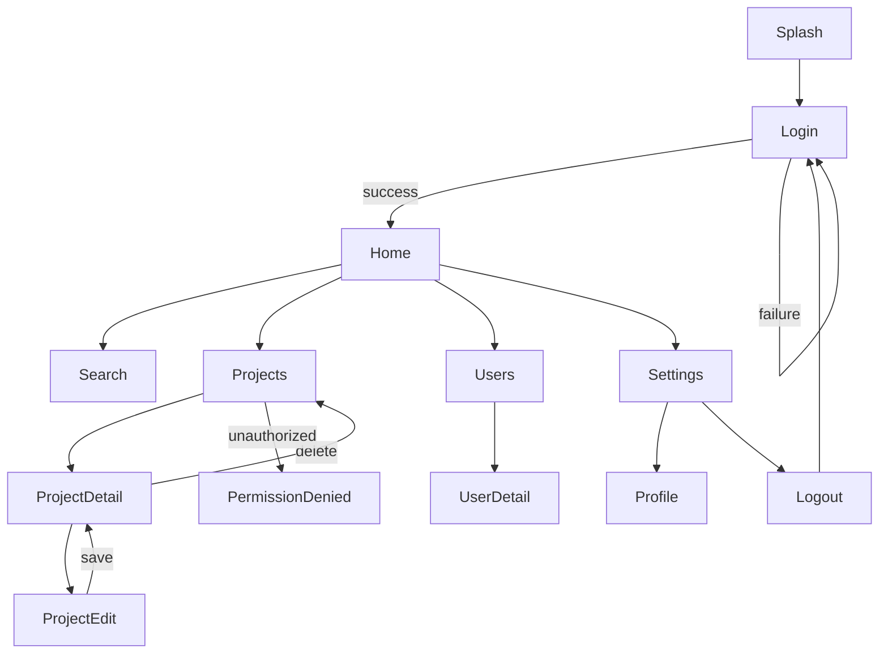

# Widgetbook as FlashKids' executable UI/UX specification

> **Status:** proposed architecture and implementation plan. This document does
> not imply that the described screens, routes, fakes, or Widgetbook entry point
> have already been implemented.

## 1. Current codebase assessment

FlashKids is currently a minimal Flutter foundation:

- `lib/main.dart` owns the application entry point, a Riverpod `Provider` that
  constructs a one-route `GoRouter`, the app shell, and the only screen.
- The only route is `/`; there are no domain models, repository contracts,
  authentication rules, feature modules, or generated Widgetbook catalogue yet.
- `pubspec.yaml` already selects the core tools needed by this proposal:
  Widgetbook and its annotations, Riverpod, `go_router`, `mocktail`, Flutter
  tests, golden tests through `flutter_test`, and Patrol.
- Existing tests are bootstrap smoke tests rather than product specifications.

This is the right time to establish boundaries before features grow. The main
file must stop being the composition root, router definition, and screen library
at once. The design below separates those responsibilities without building a
second application for Widgetbook.

## 2. Target architecture

```text
requirements / acceptance criteria
                 |
                 v
       executable Widgetbook spec
          /                 \
  isolated screen states    full application flow
          \                 /
           automated tests
                 |
                 v
       shared production features
          /                 \
 real infrastructure     in-memory fakes
          |                 |
       real app       Widgetbook prototype
```

Use a **feature-first, ports-and-adapters architecture** with one shared app
composition API:

1. **Presentation:** production screens, widgets, controllers, validation, and
   immutable view states. Both executables import these exact artifacts.
2. **Application/domain:** use cases, models, and repository interfaces. This
   layer contains no Widgetbook imports.
3. **Infrastructure:** real adapters for the production app and stateful
   in-memory fake adapters for Widgetbook and tests.
4. **Composition:** `AppDependencies`/Riverpod overrides select adapters; an
   `AppRouterFactory` builds a fresh router from the same route manifest and
   redirect policy for either runtime.
5. **Specification:** Widgetbook stories configure dependencies and initial
   state only. They never copy a production screen or reproduce business logic.

### Architecture decisions

| Decision | Why / problem solved | Trade-off and maintenance impact |
|---|---|---|
| Feature-first modules | Keeps each screen, state, controller, and tests discoverable to humans and AI. | More folders and explicit exports, but no duplicated implementation. |
| Repository interfaces as ports | Real and fake backends exercise identical application behavior. | Requires deliberate contracts; reduces mocking details throughout UI code. |
| Stateful in-memory fakes for the full flow | Create/edit/delete/login actions persist during a prototype session and remain deterministic. | Fakes need contract tests and reset controls; they are a small maintained adapter, not a second business layer. |
| Riverpod overrides at composition boundaries | The project already uses Riverpod, and overrides make scenario setup explicit. | Provider scope discipline is required; avoids service locators and global mutable state. |
| One route manifest and one router factory | Production and prototype share paths, redirects, transitions, and deep links. | Runtime-specific startup destinations must be parameters, not forked router files. |
| Explicit immutable screen state | A state matrix becomes executable and straightforward to test. | Adds state types; prevents ambiguous combinations of booleans and story-only hacks. |
| Widgetbook for specification, tests for assertions | Supports exploration without pretending a catalogue is a complete regression suite. | Some scenarios appear both as stories and tests, but only setup data is shared—behavior is not reimplemented. |

## 3. Proposed folder structure

```text
lib/
  main.dart                         # production bootstrap only
  app/
    flash_kids_app.dart             # shared MaterialApp.router shell
    app_dependencies.dart           # typed dependency/composition contract
    navigation/
      app_route.dart                # typed names/paths
      route_spec.dart               # route metadata and graph edges
      app_router_factory.dart       # GoRouter construction + redirects
      auth_redirect.dart
  core/
    errors/
    validation/
    widgets/
  features/
    auth/
      domain/auth_repository.dart
      application/login_controller.dart
      presentation/login_screen.dart
      presentation/login_state.dart
      presentation/widgets/
    home/...
    projects/...
    profile/...
    settings/...
  infrastructure/
    api/
    repositories/                   # production adapters

widgetbook/
  main.dart                         # separate Flutter entry point
  widgetbook_app.dart               # catalogue and global addons
  app_prototype/
    full_application_flow.dart      # exactly one complete-flow use case
    prototype_dependencies.dart
    prototype_seed.dart
  components/                       # component stories only
  screens/                          # isolated screen stories
    auth/login_stories.dart
    home/home_stories.dart
  support/
    scenario.dart
    story_harness.dart
    fake_clock.dart
    fakes/
      fake_auth_repository.dart
      fake_project_repository.dart
      fake_user_repository.dart

test/
  unit/                             # validation, controllers, use cases, fakes
  widget/                           # screen behavior and semantics
  golden/                           # approved state/view matrices
  navigation/                       # router redirect/back/deep-link tests
integration_test/
  critical_journeys_test.dart
tool/
  generate_navigation_docs.dart
docs/
  widgetbook_executable_spec.md
  generated/navigation.mmd           # generated; never hand-edited
```

Keeping `widgetbook/` outside `lib/` prevents catalogue-only code from entering
the production dependency graph. Production code must never import from
`widgetbook/`. Story support that is also useful to automated tests can live in
a dedicated test-support package later, but should not be moved prematurely.

## 4. Packages and tools

### Use now

- **`widgetbook` + `widgetbook_annotation`:** catalogue, hierarchy, use cases,
  knobs, and global device/theme/locale exploration.
- **`build_runner`:** generate the Widgetbook catalogue and existing model code.
- **`flutter_riverpod`:** production state management and dependency overrides.
- **`go_router`:** real routing, redirects, nested routes, and back behavior.
- **`flutter_test`:** unit, widget, navigation, and golden assertions.
- **`mocktail`:** interaction-focused unit tests only; prefer deterministic
  handwritten fakes for prototypes.
- **Patrol:** a small number of critical end-to-end journeys on supported
  devices. Flutter's `integration_test` can be used directly when Patrol adds no
  value.

### Add only when justified

- A golden orchestration package may be added after the first golden suite proves
  that raw `matchesGoldenFile` is too repetitive.
- Widgetbook Cloud may provide hosted review and visual regression once the team
  has a workspace and CI policy. The local executable specification must remain
  usable without it.
- Do not introduce a second router, state-management library, generic mock API
  server, or BDD framework merely for Widgetbook.

Versions should be pinned through the generated lockfile and updated
intentionally in CI; using unconstrained `any` ranges in the manifest makes spec
builds less reproducible across clean environments.

## 5. Widgetbook information architecture

The catalogue has three stable top-level areas:

```text
Components
  Buttons
  Form fields
  Cards
Screens
  Login
    Default
    Submitting
    Validation Error
    Authentication Error
  Projects
    Loading
    Empty
    Populated
    Load Error
    Permission Denied
App Prototype
  Full Application Flow
```

**Components** specify reusable visual primitives. **Screens** specify one
screen at a time with controlled state and environment. **App Prototype** has a
single `Full Application Flow` entry that boots the whole app with fakes. Do not
split the main journey into many competing mini-app flows. A narrowly scoped
flow may exist temporarily for development, but is not part of the published
spec hierarchy.

Global addons cover viewport/device, text scaling, locale, theme, accessibility
inspection, and any supported platform surface. Knobs should control genuine
input data (long title, item count, user role), not expose arbitrary internal
state that a user could never reach.

## 6. Screen specifications and state definition

Every screen owns a sealed/immutable view-state model with the minimum meaningful
states. Do **not** mechanically add Default, Loading, Empty, Error, Validation,
Success, Disabled, and Permission Denied to every screen.

Example state matrix:

| Screen | Meaningful states | Primary actions and expected results |
|---|---|---|
| Login | default, submitting, validation error, authentication error | Submit validates locally; valid data calls auth; success goes Home; failure remains and announces error. |
| Project list | loading, empty, populated, load error, permission denied | Retry reloads; select opens Detail; create opens editor if authorized. |
| Project detail | loading, loaded, not found, permission denied, delete failure | Edit opens editor; delete asks confirmation then returns to list on success. |
| Project editor | create, edit, validation error, saving, save error | Valid save persists then opens Detail; invalid input stays and exposes field errors. |
| Settings | loaded, logout in progress, logout error | Profile opens Profile; successful logout clears session and redirects Login. |

Each story should be a small declarative `Scenario<TState>` containing:

- stable scenario ID such as `auth.login.validation_error`;
- requirement/acceptance-criterion IDs;
- initial domain seed and dependency behavior;
- viewport/theme/locale defaults where relevant;
- expected visible state;
- allowed user actions and semantic finder/test IDs;
- expected side effects/navigation destinations.

The builder passes state or provider overrides to a shared `StoryHarness`, then
renders the production screen. Interactive screen stories may invoke the real
controller. Pure rendering stories can inject a fixed view state. The scenario
metadata explains the contract, while the executable production widget proves
it can render that contract.

### Story naming convention for AI

```text
<feature>.<screen>.<state>
projects.list.empty
projects.detail.permission_denied
auth.login.authentication_error
```

At the top of each story file, include a compact spec block:

```text
Requirement: AUTH-LOGIN-001
Given: signed-out user; fake auth accepts demo@example.com / password123
When: user enters valid credentials and taps login
Then: repository is called once; session becomes authenticated; route is /home
Test coverage: test/widget/auth/login_screen_test.dart
```

Use stable domain language, route names, scenario IDs, keys, and semantics
labels. Avoid prose-only requirements: validation, actions, and outcomes must be
wired through controllers/fakes in interactive stories and asserted in tests.

## 7. Full Application Flow

`Full Application Flow` creates a **fresh session sandbox** every time its use
case is mounted:

1. Construct `PrototypeStore` with deterministic users, projects, permissions,
   fake clock, and configurable latency/failure rules.
2. Create fake repository adapters over that store.
3. Build a `ProviderScope` with repository/auth/clock overrides.
4. Create a fresh `GoRouter` using the production `AppRouterFactory` and route
   manifest. Never share a global router between story remounts.
5. Render the shared `FlashKidsApp.router` (or equivalent app shell).
6. Dispose router, streams, and store when the story unmounts.

Conceptually:

```dart
Widget buildFullApplicationFlow(BuildContext context) {
  final sandbox = PrototypeSandbox.seeded(PrototypeSeed.demo);
  final router = AppRouterFactory(sandbox.authListenable).create();
  return ProviderScope(
    overrides: sandbox.providerOverrides,
    child: FlashKidsApp.router(routerConfig: router),
  );
}
```

This is illustrative API shape, not code to copy before the contracts exist.
Widgetbook chrome must not intercept the app's internal navigation. Reviewers
can start at Login and reach every normal branch through visible actions:
Home/Search, Projects/List/Detail/Edit, Users/Detail, Profile, Settings, Logout,
and permission/error paths. Deep-link and scenario reset controls can be
developer-only prototype tools, but they do not replace clickable journeys.

### Real behavior and fake failures

- Use the real form validators and controllers.
- Fakes implement the same repository contracts and return the same domain
  failures as real adapters.
- A fake auth session emits changes, so router redirect logic reacts exactly as
  it does in production.
- Mutations update an in-memory store and notify watchers. Creating a project
  makes it appear in lists; editing updates detail; deleting removes it.
- Confirmation UI is production UI, not a Widgetbook control.
- Seed special accounts/data for deterministic branches, for example an
  unauthorized viewer and a login that produces an authentication failure.
- Provide reset-to-seed and optional latency/failure toggles in a clearly marked
  prototype debug panel. Reset must replace the entire sandbox atomically.

Handwritten fakes are preferable to Mocktail here because they model coherent,
long-lived state. Mocktail remains useful for verifying a controller calls a
repository in a unit test. Fakes must pass repository contract tests shared with
real adapters where practical, preventing fake behavior from silently drifting.

## 8. Router reuse and navigation specification

Extract route identity and graph metadata from router construction:

```text
RouteSpec
  name, path, parent, auth policy, permission policy, graph label
          |
          +--> AppRouterFactory --> GoRouter routes and redirects
          +--> navigation doc generator --> Mermaid
          +--> navigation tests --> reachability and redirect assertions
```

The actual page builders still reference production screens. Authentication and
permission redirects depend on injected interfaces, not concrete API clients.
The app and prototype each call the same factory with different dependencies.
Initial location and observers may be parameters, but routes and policies are
not copied.

Avoid generating `GoRoute` builders from a documentation-only graph if doing so
makes type-safe parameters obscure. It is sufficient for the typed route
manifest consumed by the factory to expose graph edges for documentation.
A CI check regenerates `docs/generated/navigation.mmd` and fails on a dirty diff.

Target graph (illustrative until product routes are approved):



The checked-in generated file is easy to review in Markdown and consumable by
AI, while the manifest remains the single source of truth.

## 9. Relationship to TDD

For each vertical feature slice:

1. Record requirement IDs and acceptance criteria.
2. Add/adjust route and scenario contracts (the Widgetbook spec may initially
   fail to compile while the slice is being built on a feature branch).
3. Define meaningful screen stories and update the full-flow reachable graph.
4. Translate expected behavior into failing tests.
5. Implement domain/application code, then the production screen.
6. Make unit/widget/navigation/integration tests pass.
7. Generate and review goldens.
8. Manually explore the isolated stories and full flow for interaction quality.
9. Regenerate and verify the navigation diagram and catalogue.

The reusable asset is **scenario input data and dependency setup**, not a shared
function that contains assertions or business behavior. Tests should name the
same requirement/scenario ID as the story so AI can traverse:

```text
requirement ID -> scenario ID -> production screen/controller -> test file
```

### Test strategy

| Test type | Responsibility | Examples | What it does not replace |
|---|---|---|---|
| Unit | Fast domain rules, validation, controller transitions, redirect policy, fake contracts. | Invalid email; login maps failure; delete updates store. | Rendering and navigation integration. |
| Widget | Screen behavior with provider overrides, semantics, validation, and local navigation effects. | Submit disabled; retry works; error announced; tap opens named route. | Pixel review and whole-device journeys. |
| Golden | Stable visual states across a curated theme/locale/viewport matrix. | Login errors; empty projects; permission denied. | Interaction, semantics, animation correctness. |
| Navigation/widget integration | Real router with fakes: redirects, back stack, deep links, branch reachability. | Logout redirects; edit back returns detail; unauthorized route denied. | Device/plugin behavior. |
| Integration/Patrol | Few critical journeys using a packaged app and realistic platform interaction. | Login-create-edit-delete-logout. | Exhaustive state combinations. |
| Widgetbook review | Exploratory visual/interaction acceptance and discoverable executable specification. | Browse edge states and all app branches. | Automated pass/fail guarantees. |

CI should run formatting, static analysis, unit/widget/navigation tests,
catalogue code generation consistency, navigation-doc consistency, and selected
goldens. Integration/Patrol and broad visual regression can run in a slower
pipeline.

## 10. Acceptance criteria for the specification system

- There is exactly one published `App Prototype / Full Application Flow` use
  case, using production screens, router rules, validation, and controllers.
- Starting from signed out, a reviewer can click through every approved route
  branch, return/back correctly, encounter permission and failure behavior, and
  logout to Login without a real backend.
- Every product screen has only meaningful isolated state stories.
- No production file imports Widgetbook or fake infrastructure.
- A prototype mutation remains visible during the current session and a reset
  restores deterministic seed data.
- Route redirects and graph reachability have automated tests.
- Every story has a stable scenario ID and links to requirement IDs and tests.
- Mermaid output is generated from route metadata and CI detects drift.
- The Widgetbook executable can build independently of production secrets and
  network services.

## 11. Implementation plan (no implementation in this proposal)

### Phase 0 — agree on contracts

1. Approve route inventory, authentication/permission policies, initial screen
   inventory, supported locales/themes/viewports, and requirement ID format.
2. Define the first vertical slice (recommended: Login -> Home -> Logout) and its
   acceptance criteria.

**Exit:** route and state matrices are reviewable; no speculative screens are
created.

### Phase 1 — separate the production composition root

1. Move the shared app shell and Home screen out of `main.dart`.
2. Introduce repository interfaces and Riverpod providers only for the first
   slice.
3. Extract typed routes, redirect policy, route manifest, and router factory.
4. Keep `main.dart` as production bootstrap wiring real adapters.

**Tests:** unit redirect/validation tests and existing app smoke test.

### Phase 2 — bootstrap Widgetbook

1. Add `widgetbook/main.dart`, annotations, generated catalogue, global addons,
   and a development run command.
2. Add `StoryHarness` with theme/localization/provider configuration.
3. Establish the `Components / Screens / App Prototype` taxonomy and lint/review
   conventions preventing production imports of story code.

**Tests/checks:** catalogue generation, analysis, and Widgetbook build smoke test.

### Phase 3 — executable Login screen spec

1. Define Login view states, controller, validation, and scenario IDs.
2. Add only Login's meaningful isolated stories.
3. Write unit, widget, and selected golden tests before completing UI behavior.
4. Cross-link requirement, story, and test IDs.

**Exit:** default, submitting, validation, auth failure, and success behavior are
executable and tested.

### Phase 4 — stateful prototype sandbox and full flow

1. Implement fake auth and first repositories over `PrototypeStore`.
2. Add deterministic seeds, fake clock/latency, failures, permissions, reset,
   lifecycle disposal, and repository contract tests.
3. Add the single Full Application Flow story using a fresh production router.
4. Verify login success/failure, Home branch, back, and logout interactively and
   with navigation tests.

### Phase 5 — grow by vertical slices

For Projects, Users, Profile, and Settings, repeat: contract -> state stories ->
failing tests -> production implementation -> fake adapter behavior -> full-flow
reachability. Never create all fake repositories in advance.

### Phase 6 — generated navigation documentation

1. Expose graph edges from `RouteSpec`.
2. Generate Mermaid deterministically.
3. Check generated output into `docs/generated/` and add a CI dirty-diff check.
4. Add a reachability test ensuring approved routes can be reached from the
   prototype start under at least one valid role/state.

### Phase 7 — CI and visual governance

1. Add curated golden matrices and an explicit approval/update process.
2. Run fast tests and generation checks on each change.
3. Add a small critical Patrol suite; evaluate hosted Widgetbook visual review
   only after local workflows stabilize.
4. Document ownership: feature teams own their screens/stories/tests; platform
   ownership covers harness, router manifest, generators, and sandbox utilities.

## 12. Risks, Widgetbook limits, and mitigations

| Limitation / risk | Mitigation |
|---|---|
| Widgetbook is not a free-form design canvas or strong visual graph tool like Figma. | Keep Mermaid generated from route specs; retain Figma only for early divergent exploration, complex motion studies, and non-executable stakeholder ideation. |
| Catalogue chrome, nested sizing, and browser history can differ from a packaged app. | Use device frames for state review and validate critical routes in router/integration tests and packaged builds. |
| Plugin, camera, push, deep OS permission, keyboard, and accessibility behavior may not be faithful on web. | Hide external services behind ports; simulate domain outcomes in Widgetbook and verify platform behavior with device integration tests. |
| Animations and gestures are harder to specify as static states. | Add interactive stories and explicit duration/gesture acceptance criteria; use widget/integration tests for outcomes. |
| Too many combinatorial stories become noise. | Maintain a screen state matrix, pairwise/curated environment coverage, knobs for data variation, and a review rule requiring user value for every story. |
| Fakes can drift from real backend semantics. | Share domain failures/models, run adapter contract tests, keep fakes behavior-focused, and avoid duplicating server implementation details. |
| Full-flow state can leak between reviews/tests. | Construct and dispose a sandbox/router per mount; deterministic seeds and atomic reset are mandatory. |
| Documentation can drift from routes. | Generate Mermaid from route metadata and fail CI on a diff. |
| AI may infer behavior from story names alone. | Require stable IDs, Given/When/Then metadata, semantic actions, executable controllers, expected results, and linked automated tests. |

Widgetbook therefore replaces a large part of Figma's clickable prototype and
component-state handoff, but not high-fidelity free-form design exploration,
collaborative drawing, or automated verification. Its value is that the accepted
spec is made from production UI and behavior, so the distance from requirement
to tested implementation stays small.
